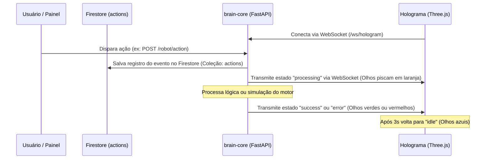

# Plano de Implementação: Conexão do Holograma com Back-end & Firestore (Fase 2)

Este plano descreve a estratégia para conectar a interface holográfica 3D (`HologramOptimus`) ao back-end em FastAPI (`brain-core`) e ao banco de dados Firestore em tempo real. Além disso, arquivamos aqui as demais ideias futuras do projeto para que nada se perca à medida que o desenvolvimento avança.

> [!NOTE]
> O objetivo principal é criar um sistema dinâmico de Edge/Interface: sempre que uma nova ação for disparada no backend ou no Firestore, o holograma reagirá mudando seus estados visuais (`idle`, `processing`, `success`, `error`) em tempo real através de WebSockets.

---

## 📋 Arquivo de Ideias e Roadmap (Para não esquecer)

Para garantir que nenhuma ideia seja perdida quando a conversa crescer, guardamos aqui as demais fases do **Optimus Robot**:

1. **📺 Interface de Controle Web Completa (`control-panel`)**:
   - Painel web em Node.js/React com visual premium futurista (glassmorphism).
   - Exibição de gráficos de telemetria em tempo real, status do hardware (Arduino, Jetson, Raspberry) e controle remoto dos motores.

2. **🔄 Mensageria Assíncrona com Redis**:
   - Integração com Redis para comunicação desacoplada e veloz entre os módulos (Master <-> Edge AI <-> Arduino).
   - Testes de latência de rede.

3. **🧠 Inteligência Artificial Avançada (`ai_service.py` & OpenAI)**:
   - Conexão do robô à API da OpenAI/Gemini para interpretação de comandos naturais por voz ou texto.
   - Criação do `context_service.py` para análise comportamental do usuário a longo prazo.

4. **🧪 QAOps e Testes de Resiliência**:
   - Testes automatizados simulando quedas de conexão, atraso de rede e falhas de hardware para validar a robustez do ecossistema distribuído.

5. **⚙️ Integração com Hardware Físico**:
   - Acoplamento do firmware em C++ (Arduino) para leitura física de sensores e acionamento de motores.
   - Configuração da Raspberry Pi como orquestrador físico local e Jetson Nano para aceleração de IA pesada (Edge AI).

---

## 🛠️ Proposta de Arquitetura da Conexão do Holograma

Para fazer a conexão em tempo real sem sobrecarregar o banco de dados e garantir resposta instantânea, usaremos a seguinte arquitetura de comunicação:

---

## 📝 Alterações Propostas

### 1. Backend (`brain-core`)

#### [NEW] [socket_manager.py](file:///C:/Users/Bruno%20PC/Desktop/Materias/Programacao/🤖%20Optimus%20Robot/optimus-robot/brain-core/app/websocket/socket_manager.py)
Gerenciador de conexões WebSocket para registrar o holograma e transmitir atualizações de estado em broadcast.

#### [NEW] [robot_routes.py](file:///C:/Users/Bruno%20PC/Desktop/Materias/Programacao/🤖%20Optimus%20Robot/optimus-robot/brain-core/app/routes/robot_routes.py)
Rotas de controle do robô (ex: `/robot/action`) para registrar comandos, salvar no Firestore (coleção `actions`) e disparar eventos visuais no holograma.

#### [NEW] [hologram_service.py](file:///C:/Users/Bruno%20PC/Desktop/Materias/Programacao/🤖%20Optimus%20Robot/optimus-robot/brain-core/app/services/hologram_service.py)
Serviço para controlar e validar os estados de animação enviados ao holograma.

#### [MODIFY] [main.py](file:///C:/Users/Bruno%20PC/Desktop/Materias/Programacao/🤖%20Optimus%20Robot/optimus-robot/brain-core/app/main.py)
Importar e registrar a rota do WebSocket e as novas rotas do robô.

---

### 2. Holograma Frontend (`HologramOptimus`)

#### [MODIFY] [index.html](file:///C:/Users/Bruno%20PC/Desktop/Materias/Programacao/🤖%20Optimus%20Robot/HologramOptimus/index.html)
- Integrar a conexão WebSocket nativa em JavaScript apontando para `ws://localhost:8000/ws/hologram`.
- Tratar reconexão automática caso o backend caia.
- Adicionar um painel de controle flutuante com design premium para testes manuais rápidos (botões como "Simular Ação do Motor", "Simular Erro", "Simular Sucesso") que interagem diretamente com o backend e gravam no Firestore.

---

## 🧪 Plano de Verificação

### Teste Manual
1. Iniciar o backend com Docker Compose (`docker compose up -d`).
2. Abrir o arquivo `HologramOptimus/index.html` no navegador.
3. Verificar no console de desenvolvedor do navegador (F12) se a conexão WebSocket foi estabelecida com sucesso.
4. Utilizar o painel flutuante de testes para disparar ações.
5. Validar:
   - Se o robô reflete visualmente a cor correspondente à ação em tempo real.
   - Se a coleção `actions` do Firestore é atualizada corretamente com o `userId` correspondente.
